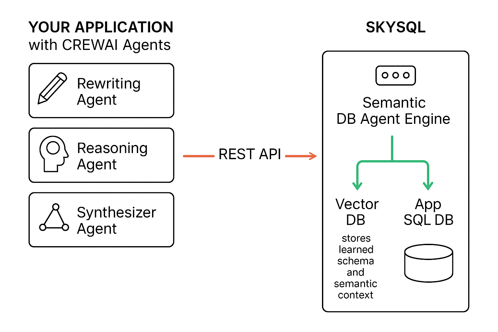

# SkySQL Semantic DB Crew

## Description

SkySQL Semantic DB Crew enables natural language conversations with complex SQL databases by bridging the gap between language models and real-world schemas.  
Unlike simple SQL generation tools, this crew incorporates semantic context, schema understanding, vector-based memory, and human guidance to achieve high-accuracy query generation.

Powered by SkySQL DB Agents, this crew provides a no-code approach to database context modeling. Once the agents are configured, they can be accessed through secure REST APIs and used as tools in CrewAI agent flows.

This crew is especially valuable when accuracy, schema complexity, and query reliability are essential.

## Why use SkySQL DB Agents?

While it is possible to generate SQL given some schema description to a language model or use APIs in frameworks, it is rather challenging to generate accurate SQL for real-world databases with high complexity.

You need the correct context, the ability for humans to add missing semantic information (e.g., map common terms to columns), and a mechanism to store relevant context such as schema, categorical values, etc., in vector stores.

SkySQL DB Agents provide a no-code UI to autonomously learn the database context. It is also secure and reliable. Your application or CrewAI agent crews access these DB Agents as simple tools through REST APIs.
Think of SkySQL Semantic DB Agents as the AI equivalent of DB stored procedures or a App 'Data Access Layer'.




## How do I create these DB Agents?

Well, there is no coding involved. You should know the specific problems you need solved and sufficient knowledge on the Data model. 

Here are the steps:

- Visit the SkySQL portal at https://app.skysql.com, sign up, and click on "SkyAI Agents".
- You need a database to work with. You can launch a SkySQL free Serverless DB, which takes just a second. Click "Dashboard" → "Launch".
- Alternatively, if you already have access to your database (MySQL or MariaDB only), add a data source by entering the DB credentials (these are securely managed by SkySQL).
- Click "Agent → Create" and define the goal/objective for your DB Agent.
- SkySQL will discover schema information, identify relationships, inspect data, and automatically select relevant tables to generate semantic context.
- You can tweak this context (which is important for complex DBs or tables) — select or deselect columns, and stick to no more than 10 tables.
- Use the playground to test and improve the agent iteratively.
- Once finalized, the agent is accessible through a REST API and can be used as a tool in frameworks like LangChain or CrewAI.

## Why a Crew on top of DB agents? 

SkySQL provides "DB-level" agents that model semantic and structural database knowledge. However, your application may still need to:

- Interact with multiple other sources
- Orchestrate reasoning across various agents
- Rewrite user queries into more precise forms
- Synthesize multi-step answers or dashboards

A higher-level CrewAI agent can take the user query, clarify intent, manage flow, and invoke the appropriate SkySQL DB agent as a tool. This improves both accuracy and UX in end-to-end pipelines.

## Example Use Cases

- Answering business questions like "What are our top-selling products this quarter?" using natural language
- Generating optimized SQL queries for dashboards or reports
- Providing product managers or analysts with chat-based analytics interfaces
- Extracting KPI summaries without writing SQL
- Powering data copilots that rewrite vague user questions into concrete, executable queries

## Configuration Instructions

1. **Clone the repository:**
   ```bash
   git clone https://github.com/skysqlinc/skysql-ai-crew.git
   cd skysql-ai-crew
   ```

2. **Create and activate a virtual environment (recommended):**
   ```bash
   python3 -m venv .venv
   source .venv/bin/activate
   ```
   *(On Windows, use `.venv\Scripts\activate` instead of `source .venv/bin/activate`)*

3. **Install dependencies:**
   ```bash
   pip install -r requirements.txt
   ```

4. **Copy the environment file and set your keys:**
   ```bash
   cp .env.example .env
   ```
   Edit `.env` and fill in your API keys and configuration.

5. **Configure your agents and tasks:**
   - Edit `src/skysql_ai_crew/config/agents.yaml` and `tasks.yaml` if you like. 

6. **(Optional) Customize the crew:**
   - Edit `src/skysql_ai_crew/crew.py` for advanced customization.

7. **Run the crew (CLI chat test app):**
   ```bash
   PYTHONPATH=src python src/skysql_ai_crew/main.py
   ```
   This launches a command-line chat interface for testing and interacting with your crew.

---

**Note:**
- The crew defined in this repository can also be imported and used as a component in other CrewAI-based applications, pipelines, or orchestration frameworks. The CLI app is provided for quick testing and demonstration purposes.

